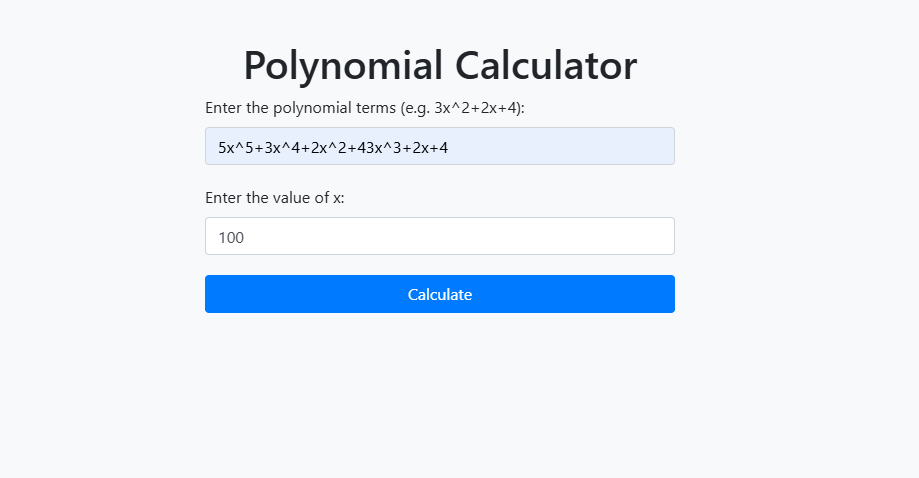
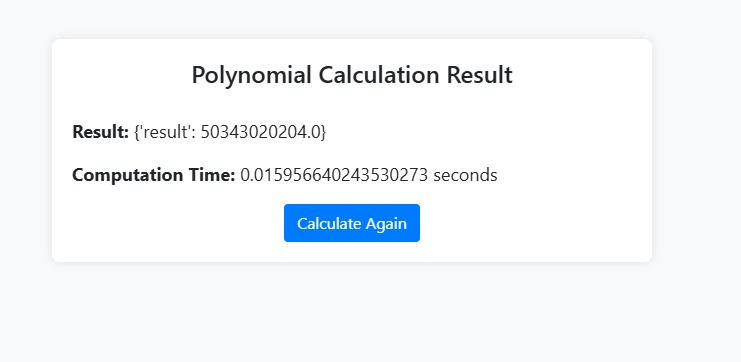

# Polynomial Calculator

The Polynomial Calculator is a Flask-based web application that evaluates polynomial expressions for a given value of \( x \). It leverages ZeroMQ for efficient communication between the server and worker nodes, dynamically allocating resources to handle complex computations.

## Features

- **Web Interface**: A user-friendly interface for entering polynomial terms and \( x \) values.
- **Distributed Computation**: Dynamically adjusts worker nodes to compute individual polynomial terms.
- **Efficient Communication**: Utilizes ZeroMQ for seamless client-server communication.
- **Results Presentation**: Displays the computation result and time taken on a clean, responsive results page.

## How It Works

### User Workflow

1. **Enter Polynomial**: Users provide the polynomial terms (e.g., `3x^2 + 2x + 4`) and a value for \( x \).
2. **Submit Request**: The data is sent to the server via a Flask route.
3. **Distributed Processing**: The server dynamically assigns polynomial terms to worker nodes for computation.
4. **Receive Results**: The server aggregates results from the workers and calculates the final value, which is displayed to the user along with the computation time.

### Components

1. **Frontend**:
   - `index.html`: Input form for polynomial terms and \( x \) value.
   - `result.html`: Displays the computed result and time.

2. **Backend**:
   - `app.py`: Flask application handling the web interface and server-client communication.
   - `server.py`: Manages requests and delegates computations to workers.
   - `worker.py`: Computes polynomial terms individually.

3. **Client**:
   - `client.py`: Simulates client-server interaction.

### System Architecture

```plaintext
Client (Browser) --> Flask Server (app.py) --> Compute Server (server.py) --> Worker Nodes (worker.py)
```


## Setup and Installation

### Prerequisites

- Python 3.8 or later
- Flask
- ZeroMQ
- Bootstrap (for frontend styling)

### Installation

1. **Clone the Repository**:
   ```bash
   git clone https://github.com/BunyaminYavuz/DistributedPolyEngine.git
   ```

2. **Install Dependencies**:
   ```bash
   pip install -r requirements.txt
   ```

3. **Run the Server**:
   - Start the workers:
     ```bash
     python worker.py
     ```
   - Start the compute server:
     ```bash
     python server.py
     ```
   - Run the Flask app:
     ```bash
     python app.py
     ```

4. **Access the Application**:
   Open [http://127.0.0.1:5000](http://127.0.0.1:5000) in your web browser.

## Usage

1. Input the polynomial terms in the format `coefficient x^exponent` (e.g., `3x^2+2x+4`).
2. Provide the value of \( x \).
3. Submit to calculate the polynomial result.
4. View the computed result and computation time.

## Screenshots

### Home Page


### Result Page


## Contributing

Contributions are welcome! Please open an issue or submit a pull request for improvements.

## License

This project is licensed under the MIT License. See the [LICENSE](LICENSE) file for details.

## Acknowledgments

- Bootstrap for frontend styling.
- ZeroMQ for robust inter-process communication.
